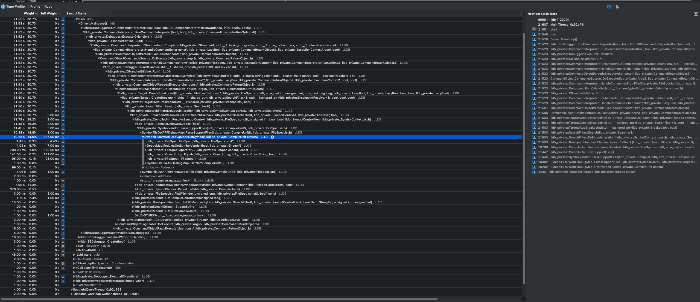
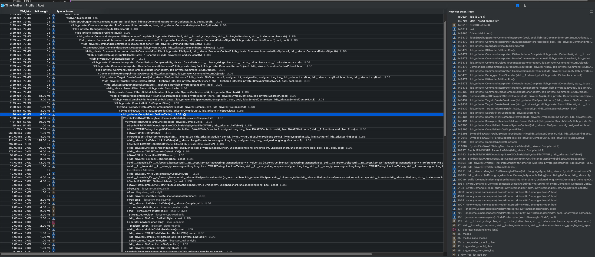

# Xcode LLDB Regression

- We are seeing that LLDB takes a very long time to execute the `set breakpoint` command with `Xcode 11.6`.
- I compared LLDB b/w Xcode 11.2.1 and Xcode 11.6. It seems that the LLDB team has changed the DWARF Debug line parser during this time which is causing slowness than before.
- Based on my understanding of the source-code ( which is very little ) https://reviews.llvm.org/D62570 is what caused the regression

LLDB shipped with Xcode 11.2.1

LLDB shipped with Xcode 11.6

You can find the profiling results [here](LLDB_Xcode_Profiling.trace.zip)
